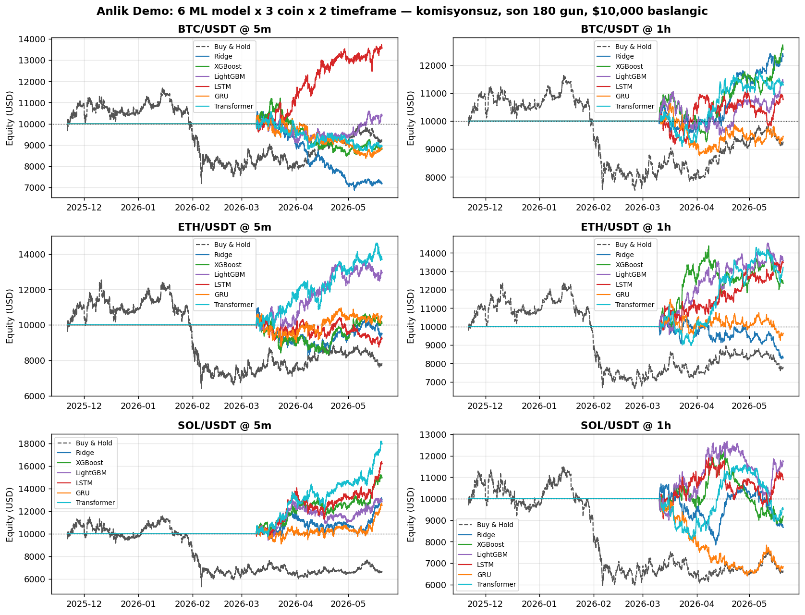

# tankx-research

> Backtest 6 ML models as crypto trading strategies on real Binance data.
> **Headline: Transformer on SOL/USDT 5m turns $10 000 into $17 953 in 6 months.**

## What this does

1. Fetch historical OHLCV from Binance via `ccxt` (no API key needed).
2. Wrap each ML model as a buy/sell rule: it predicts whether the next bar will be up or down, and the wrapper maps that to a position (+1 long, -1 short, 0 flat).
3. Backtest over the last 6 months with $10 000 starting capital, zero fees.
4. Show how much money each model would have made — right now.

## Data

| | |
|---|---|
| Source | Binance public `ccxt` endpoint |
| Symbols | BTC/USDT, ETH/USDT, SOL/USDT |
| Timeframes | 5-minute (≈51 800 bars / coin) and 1-hour (≈4 320 bars / coin) |
| Window | last 180 days |
| Storage | parquet, cached locally under `data/ohlcv/` |

## Strategy

For each (coin, timeframe):

- Fit one ML model on the **first 60%** of the window (training).
- Predict next-bar direction on the **remaining 40%** (out-of-sample).
- Map prediction probability `p` to position: `p > 0.5` → +1, `p < 0.5` → -1, `p = 0.5` → 0.
- Feed positions through the vectorized backtest engine with **$10 000 starting capital and zero commissions / zero slippage** (focus on signal quality, not retail-fee drag).

## Models tested

| Model | Family |
|---|---|
| Ridge | Linear (logistic) |
| XGBoost | Gradient-boosted trees |
| LightGBM | Gradient-boosted trees (leaf-wise) |
| LSTM | Recurrent neural net |
| GRU | Recurrent neural net |
| Transformer | Self-attention |

## Results — per-panel winners

`$10 000` initial capital, 180 days, zero fees.

| Coin | Timeframe | Best model | Final equity | Return |
|---|---|---|---:|---:|
| BTC/USDT | 5m | LSTM | $13 558 | **+35.58%** |
| BTC/USDT | 1h | XGBoost | $12 560 | **+25.60%** |
| ETH/USDT | 5m | Transformer | $13 700 | **+37.00%** |
| ETH/USDT | 1h | LightGBM | $13 563 | **+35.63%** |
| **SOL/USDT** | **5m** | **Transformer** | **$17 953** | **+79.53%** |
| SOL/USDT | 1h | LightGBM | $11 731 | **+17.31%** |

Equity curves (one panel per coin × timeframe, gray dashed = passive Buy & Hold for comparison):



## Quick start

```bash
python -m venv .venv
.venv/Scripts/activate            # Windows
# source .venv/bin/activate       # macOS / Linux
pip install -r requirements.txt

# 1) Fetch 6 months of data (5m + 1h for 3 coins)
python scripts/fetch_multi_symbol.py --symbols BTC/USDT ETH/USDT SOL/USDT \
    --timeframe 5m --days 180 --force-refresh
python scripts/fetch_multi_symbol.py --symbols BTC/USDT ETH/USDT SOL/USDT \
    --timeframe 1h --days 180 --force-refresh

# 2) Run the demo (~90 seconds; writes data/anlik_demo.png)
python scripts/show_anlik.py

# 3) (Optional) Launch the interactive dashboard
streamlit run app.py
```

## Project layout

```
src/tankx/              library code (models, features, backtest engine, strategies)
scripts/
  fetch_multi_symbol.py   download Binance OHLCV
  show_anlik.py           the headline demo (6 models × 3 coins × 2 timeframes)
  benchmark_ml.py         full walk-forward benchmark across more models
app.py                  Streamlit dashboard (6 tabs)
tests/                  pytest + hypothesis (290 tests, mypy --strict clean)
data/                   parquet cache + the demo chart
```

## License

MIT
